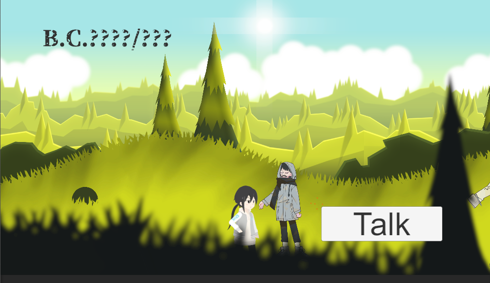

# Games
独自制作のゲームです

[作成したゲームのリンク](https://unityroom.com/games/itokon0001)

[本ページのリンク](https://github.com/Ito-Koki/Games)

ゲームシーン例

『Math Magic Memory』

使用技術:Unity

使用言語:C#

個人開発

成果物概要:ストーリー仕立ての2Dカードゲーム

制作背景:初制作であるため、自身の度量を確認する。

また、全年齢向けに誰でも遊べるような、かつプレーヤーに頭を使ってもらえるようなシステム作り。

ストーリーを通じて数学の知識を得られるようになっている意図も込めている。

テストアカウント:なし

実行環境:Unity2022.3.7f1 , Windows11

作成期間:三ヶ月

